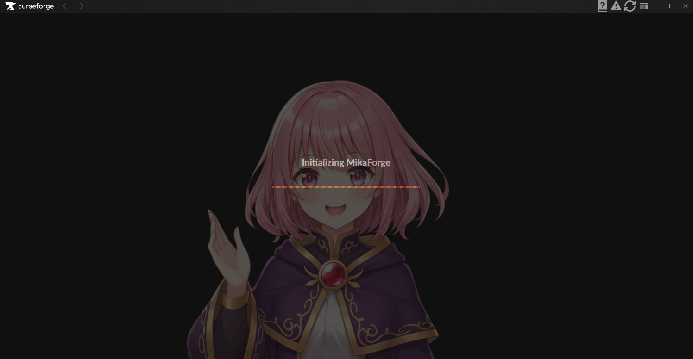
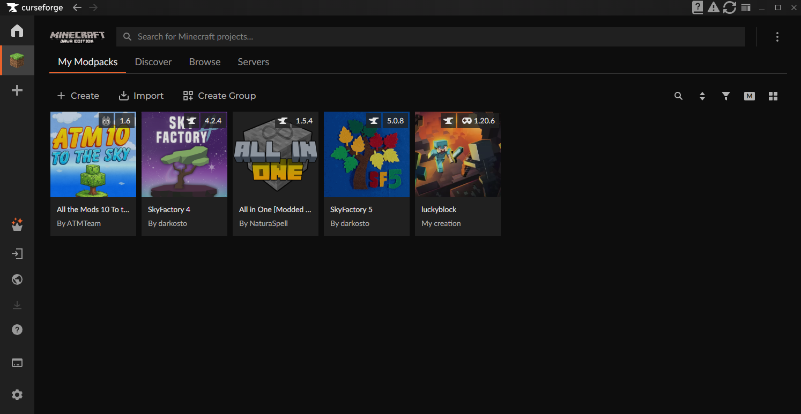
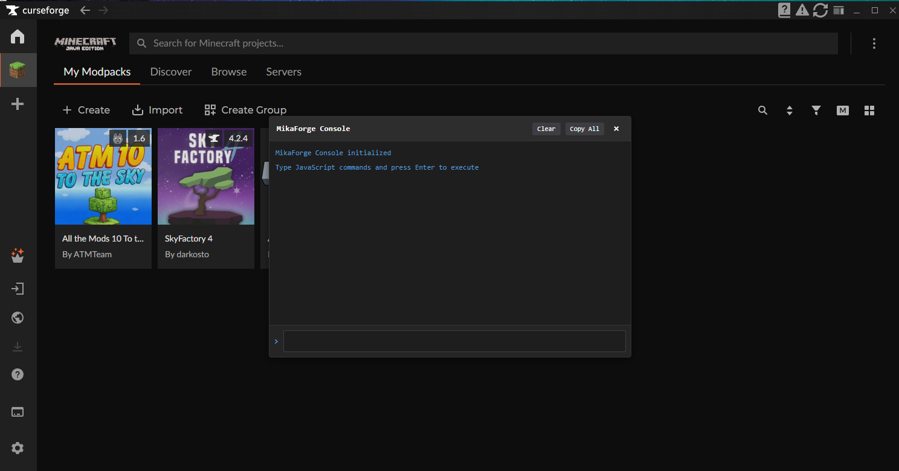
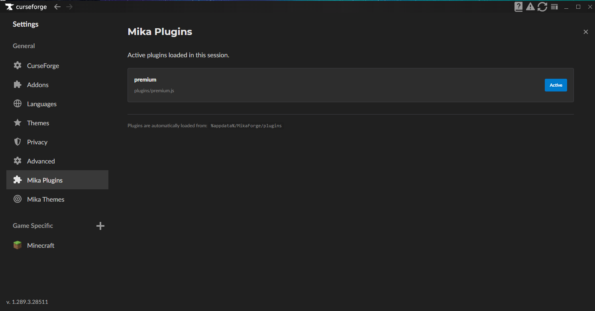
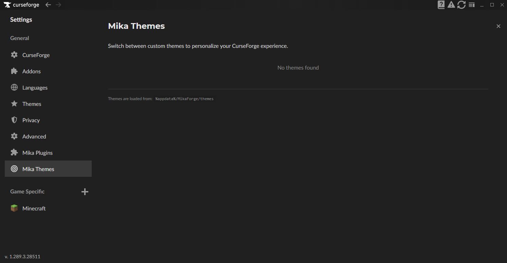

# MikaForge

A plugin framework for CurseForge that lets you customize and extend the app with community-made plugins.

# Screenshots

  
  
  
  
  

## What is this?

MikaForge modifies the CurseForge desktop client to add a plugin system, similar to what Vencord does for Discord. Load custom plugins to add features, tweak the UI, or change how the app behaves.

## Features

- Plugin support for CurseForge
- Theme support - Apply custom CSS themes to personalize your CurseForge experience
- Live CSS Editor - Real-time CSS editor with VS Code-like syntax highlighting

## Installation

1. Download the latest release from the releases page
2. Close CurseForge completely
3. Run the installer
4. Restart CurseForge

## Installing Plugins / Themes

#### You can find example plugins in the `/plugins` folder of this repository.
Drop plugins into the plugins folder:
- Windows: `%appdata%/MikaForge/plugins`

#### You can find example Themes in the `/themes` folder of this repository.
- Drop themess into the themes folder:
- Windows: `%appdata%/MikaForge/themes`

Restart CurseForge or use the reload button (Plugins only, when using a theme go to the settings and enable it)

## FAQ

**Is this against CurseForge's terms of service?**  
Probably. Use at your own risk.

**Will this get me banned?**  
No idea. We're not responsible if it does.

**Does this work with the Overwolf Version?**  
No.

## Compiling from Source

To compile the project, run `bun run compile`. This will build the project and output the compiled files in the `/Packer` folder.

To compile the uninstaller, run `bun run compile_remover`. This will build the uninstaller and output as `Uninstaller.exe`.

## Contributing

Pull requests welcome. Keep code clean and document what you're doing.

## A friendly note
Thanks for using MikaForge! We built this to make CurseForge more fun and flexible for everyone. There are just two of us working on this in our spare time, so please be patient if updates are a bit slow or bugs stick around for a while. If you find issues or have cool ideas, let us know! We'd love to hear what you think. Have fun making plugins! 

## License

MIT
